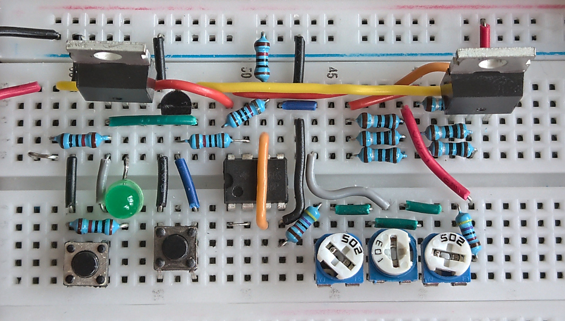
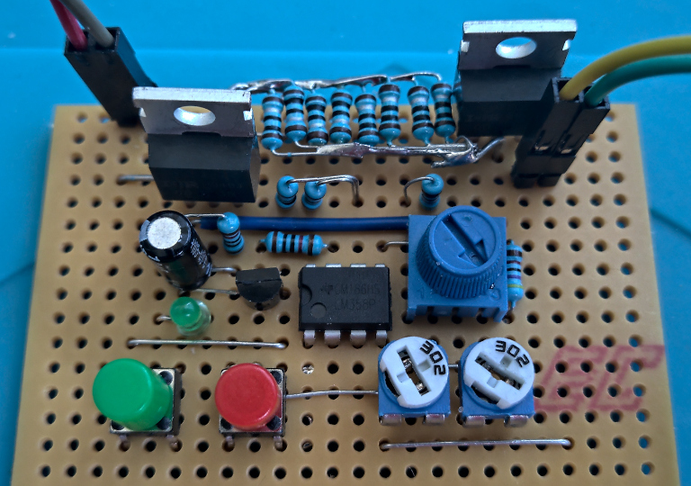
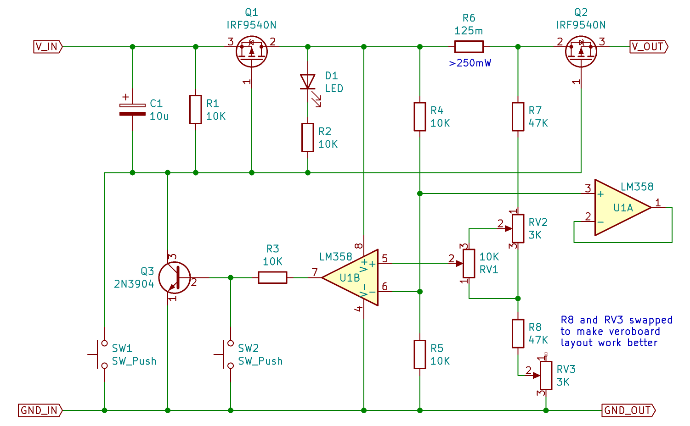

# Soft power supply circuit with tunable overcurrent protection cutoff

 | 
:----:|:----:
Assembled on breadboard | Assembled on veroboard

This is a circuit for soft-switching a 5V DC input, with a configurable current limit cutoff, tested from around 10mA up to 1.2A.

This is useful because it protects your power supply, wiring, and components against adverse effects due to things like 
short circuiting, accidental reversed power polarity, placing components incorrectly or backwards in a circuit, or other
component failure.

It's not a boost/buck converter or regulator, just a switch for an existing regulated DC input.

## Operation

Press SW1 to turn the power on.  The LED indicates that power is on.  Press SW2 to turn the power off.

Use RV2 and RV3 to tune the range of currents that are selectable.  See [configuration guide](docs/configuration.md) for the tuning procedure.

Once tuned, RV1 selects the current limit.  When more than this amount of current is drawn, the circuit automatically powers off.

## Schematic

## Bill of Materials

| Ref    | Qty  | Spec     | Notes |
| ------ |:----:| ----     | ----- |
| Q1-2   |   2  | IRF9540N | P-channel power MOSFET - ideally low RDS(on) at VGS=-4.25V |
| Q3     |   1  | 2N3904   | NPN BJT transistor |
| R1-5   |   5  | 10K      | Resistor |
| R6     |   1  | ~0.1 ohm | Power resistor, 1A continuous current, at least 1W recommended |
| R7-8   |   2  | 47K      | Resistor |
| RV1-2  |   2  | 3K       | Trim pots |
| RV3    |   1  | 10K      | Potentiometer |
| U1     |   1  | LM385    | Operational amplifier |
| C1     |   1  | 10u      | Capacitor to prevent accidental power-on (may not be necessary) |

Exact component choices are not critical.  With the above components, and 6x1ohm 250mW resistors in parallel for R6, at a continuous 1A load, 
the resistors get slightly warm to the touch and the MOSFET tabs measure 60C-70C, in open air with no heatsinks or active cooling.

The added output impedance appears to be approximately 0.75 ohms with these components, at a load current of 1A; lower currents 
lead to lower impedance.  Choosing Q1-2 with lower RDS(on) at -4.25V or more will have the greatest effect on impedance.

## Improvements

I'm considering the following:

* Use a charge pump to lower the gate voltage to Q1-2, to improve impedance at high loads
* Configure the op amp with feedback to amplify the voltage difference, in case it makes tuning the cutoff simpler
* Add an optional linear regulator to guarantee output voltage at high loads

Other suggestions very welcome!
